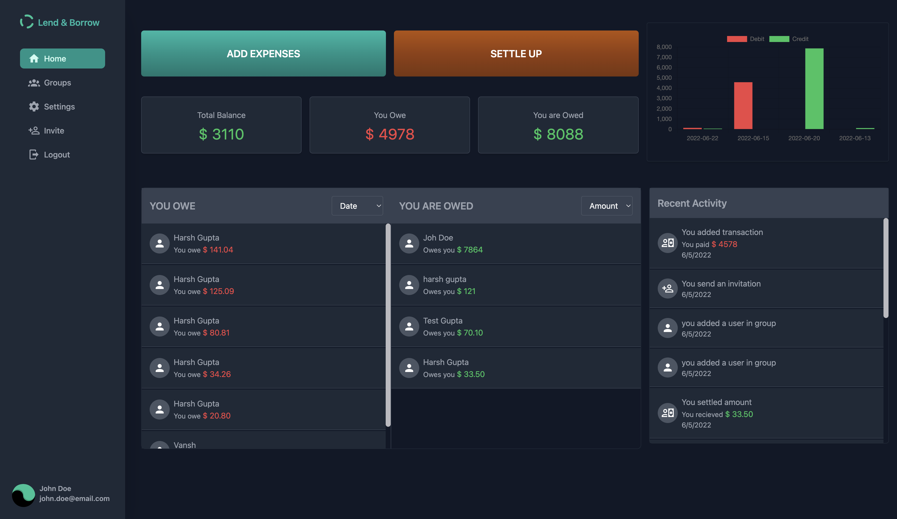
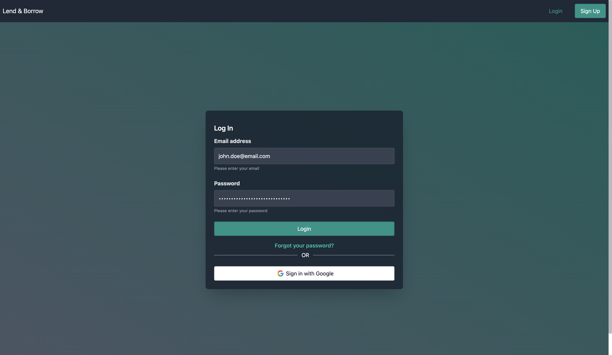
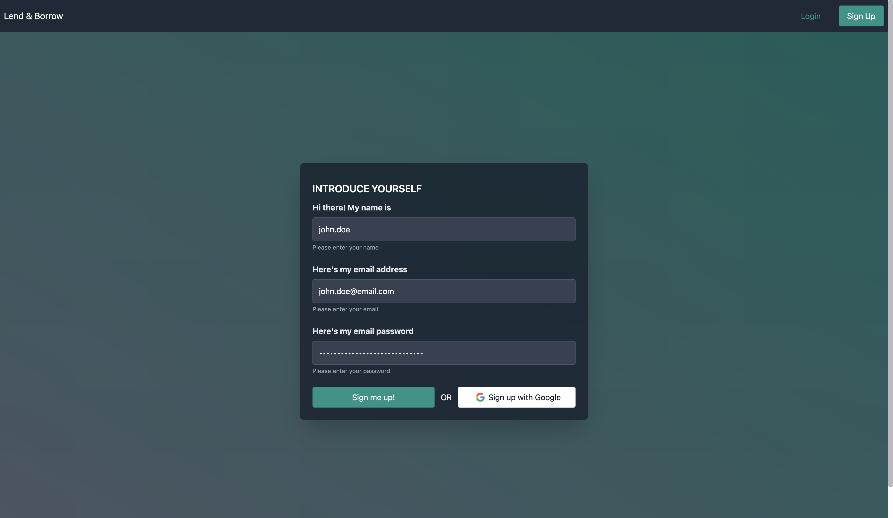
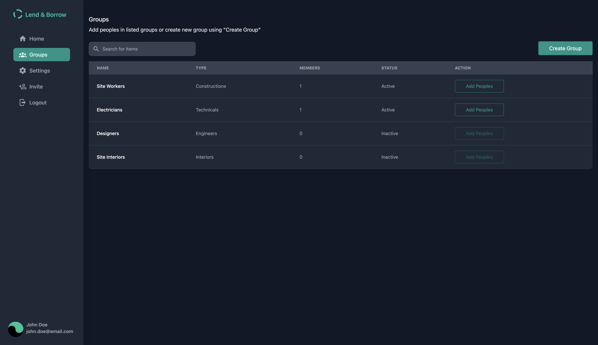
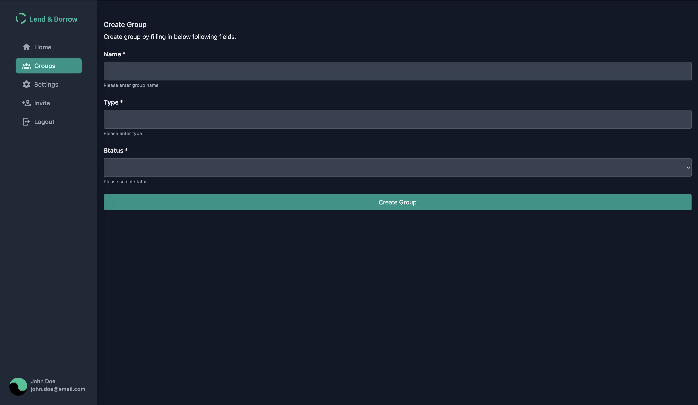
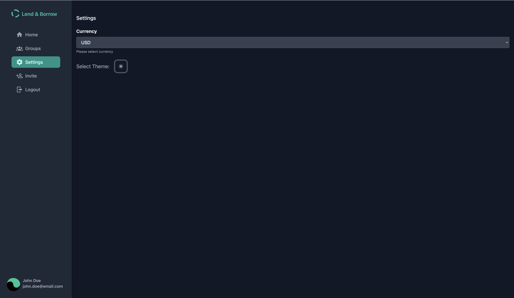
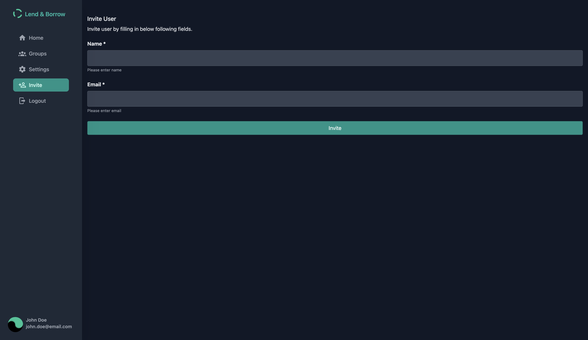
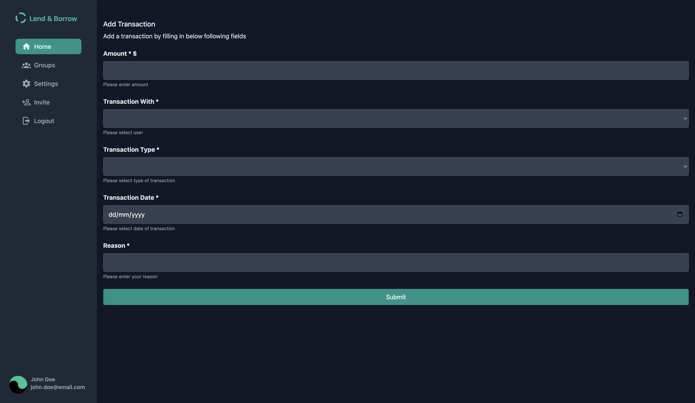
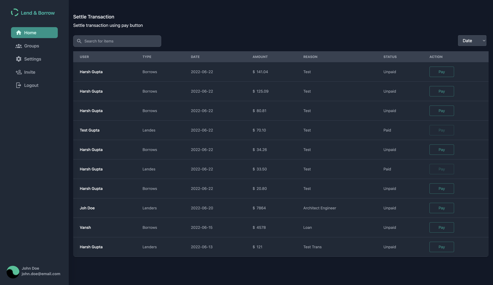
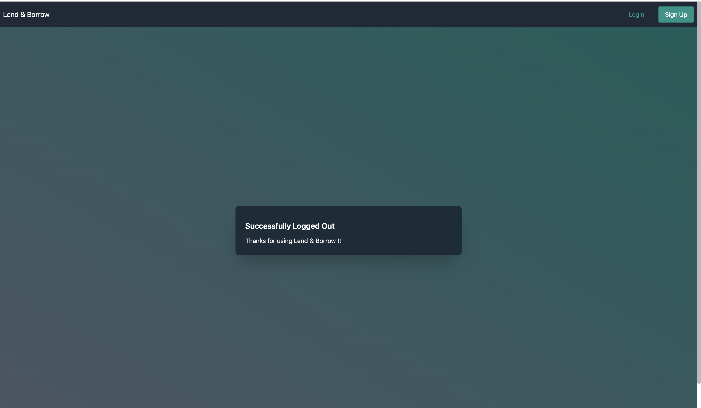

# Lend & Borrow

People have a habit of borrowing money from each other frequently, and have trouble remembering who owes whom, and how much.



## Tech Stack

**Client:** Vue 3, Vite, Tailwind, Vuex, Vue Router, Eslint, Prettier


## Demo

https://techarshgupta.github.io/vue-lend-borrow/dashboard


## Features

- Light/dark mode toggle
- Cross platform
- Login/Signup using Google
- Add transactions
- Settle transactions
- Invite peoples
- Create Groups
- Dashboards for transactions
- Log activity


## Roadmap

- Additional browser support
- Add more integrations
- Dashboards
- Email Notification
- Emails to notify for settle amount
- Multi Roles
- Admin Dashboards
- Approval workflows


## Run Locally

Clone the project

```bash
  git clone https://github.com/techarshgupta/vue-lend-borrow
```

Go to the project directory

```bash
  cd vue-lend-borrow
```

Install dependencies

```bash
  npm install
```

Start the server

```bash
  npm run dev
```

Run test cases
```bash
  npm run test
```

Lint with Eslint

```bash
  npm run lint
```

## Images

**Login**


**Sign Up**


**Groups**


**Create Group**


**Settings**


**Invite** **Peoples**


**Add** **Transactions**


**Settle** **Transaction**


**Logout**


## Feedback

If you have any feedback, please reach out to us at 246harsh@gmail.com
